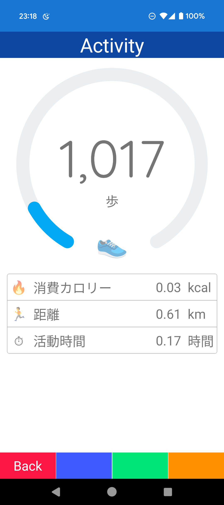
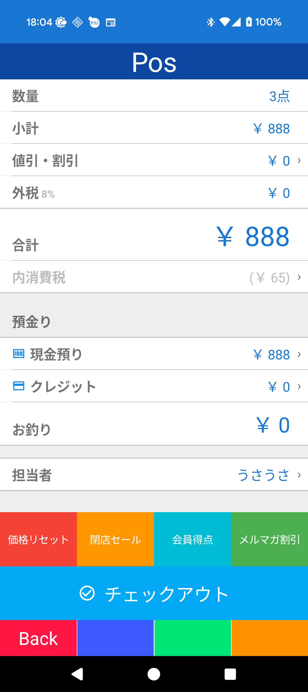
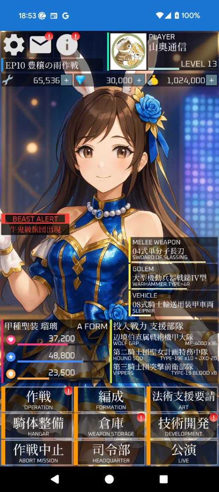

# Template project for MAUI

Template project for MAUI.

# Memo

- 物理キーボードの処理については template-maui-keyboard に分離
- Blazorベースのサンプルとして template-maui-blazor を分離

# イメージ

## Device/Sample/UI

# TODO

- Device
  - [ ] **WiFi manager**
  - [ ] Biometric
- UI
  - [ ] **Bottom sheet**
  - [ ] **Gauge**
  - [ ] Chart
  - [ ] Calendar
- Other
  - [ ] **Cognitive service**
  - [ ] **Map2**
  - [ ] **HybridWebView**
  - [ ] Chat
  - [ ] Animation
  - [ ] Media play
  - [ ] Push -> Hybrid?
  - [ ] Local notification -> Hybrid?
- API server
  - [ ] File UI
  - [ ] Data UI & api+
  - [ ] Error layout
  - [ ] Progress
  - [ ] Cloud log
  - [ ] Device status
- ReCheck
  - [ ] Check old style splash
- Ex
  - [ ] **.NET 10/XAML**

# 実装

(TODO)

- Basic
  - Typography/Style/Font
  - Converter/Behavior
  - Dialog
  - Validation
  - Grahics
- Navigation
  - Basic/Stack/Wizard
- Device
  - Device status
  - Sensor/Location
  - QR Scan(Android AI)/Display
  - Camera/OCR(Android AI)
  - BLE/Bluetooth Serial
  - NFC
  - Audio
  - Screen/Vibrate/Feed/LED/Sppek/Recognize
- Data
  - SQLite
- Network
  - Web API
- Sample
  - Object detection(Local)
  - Markdown
  - PDF reader
- UI
  - Dock
  - Timeline/TreeMap

# ドキュメント

- [開発手法](Document/Development.md)
