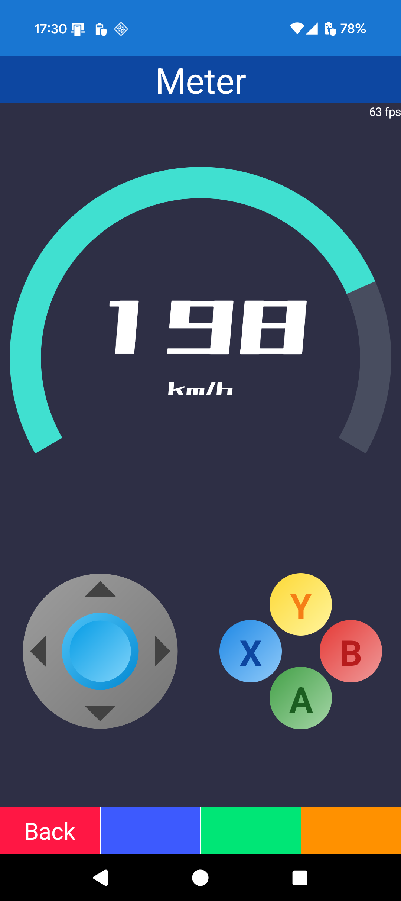
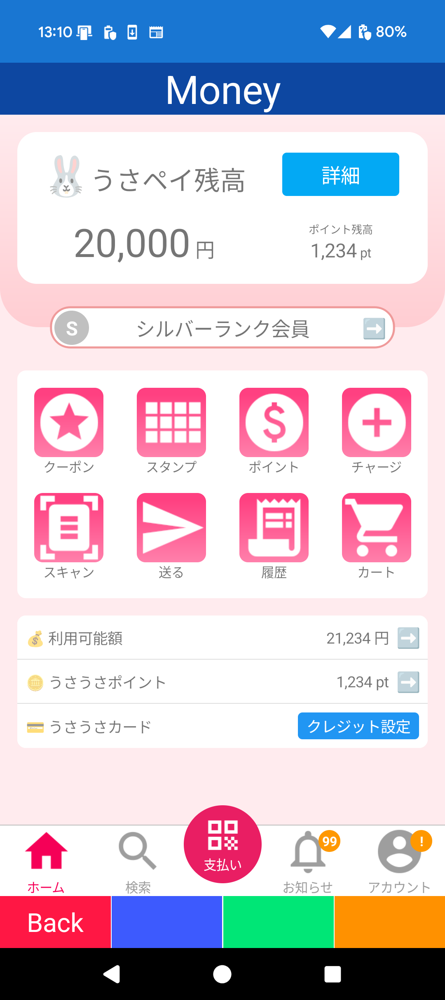
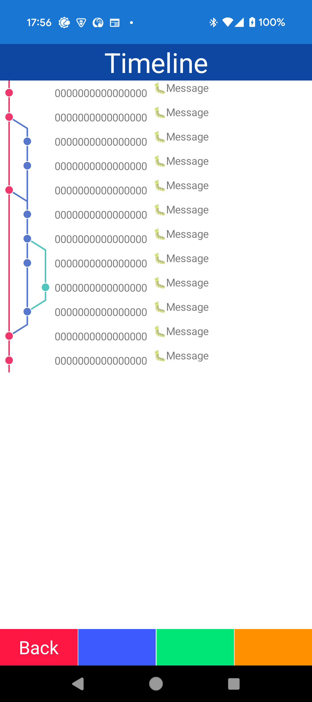

# Template project for MAUI

Template project for MAUI.

# Memo

- 物理キーボードの処理については template-maui-keyboard に分離
- Blazorベースのサンプルとして template-maui-blazor を分離

# TODO

## Cleanup

- [ ] Style sheat

## Device

- [ ] **WiFi manager**
- [ ] Biometric

## UI

- [ ] **Gauge**
- [ ] Chart
- [ ] Calendar

## Other

- [ ] **Cognitive service(API)**
- [ ] **Chat**
- [ ] **Map**
- [ ] HybridWebView
- [ ] Push

## ReCheck

- [ ] Check old style splash

## API server

- [ ] File UI
- [ ] Data UI & api+
- [ ] Error layout
- [ ] Progress
- [ ] Cloud log
- [ ] Device status

## Ex

- [ ] **.NET 10/XAML**

# イメージ

## Device

## Sample

## UI

# 実装

(TODO)

# ドキュメント

- [開発手法](Document/Development.md)
