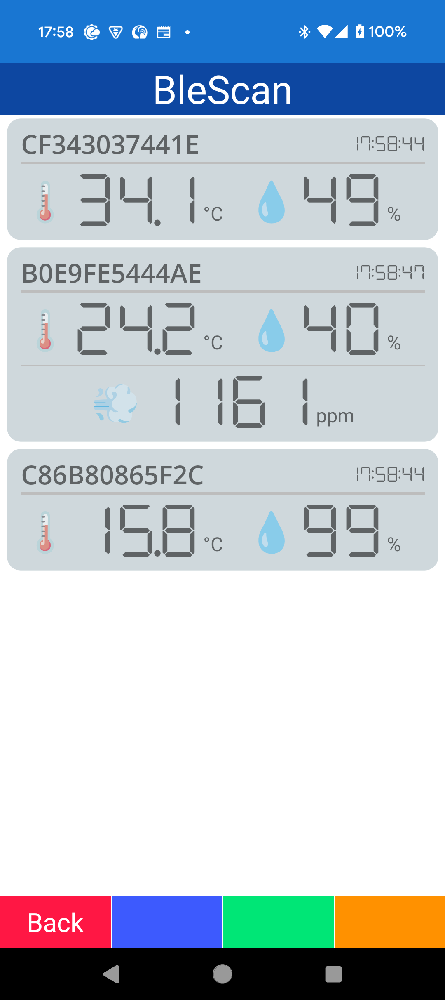
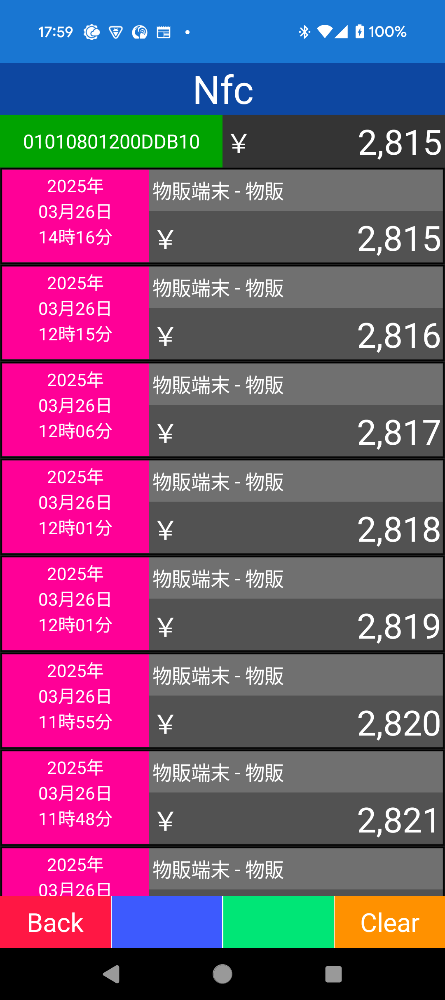
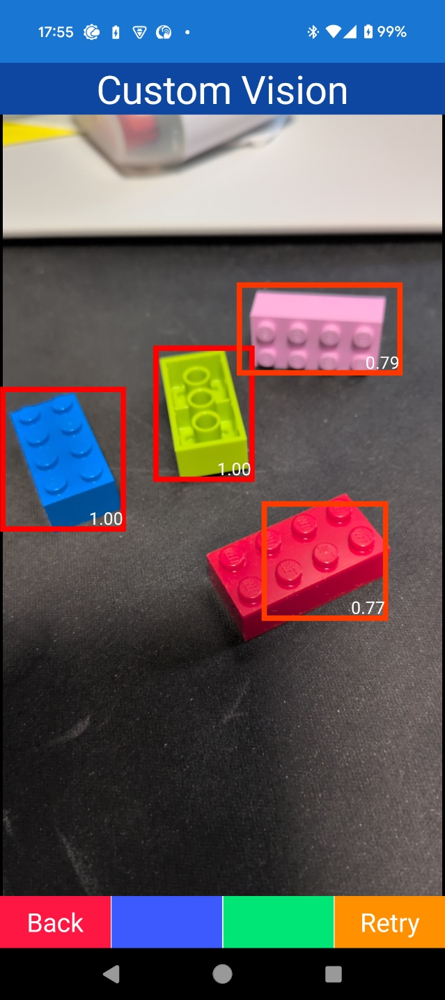
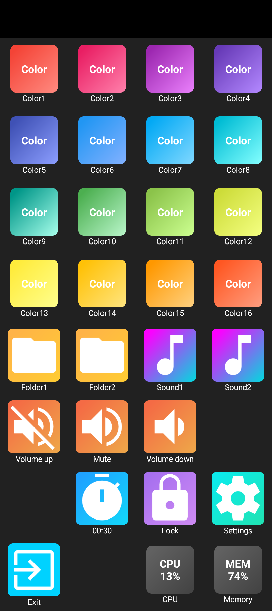
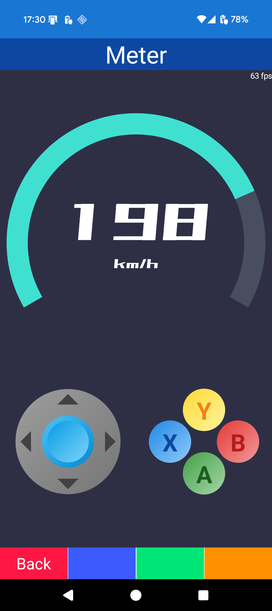
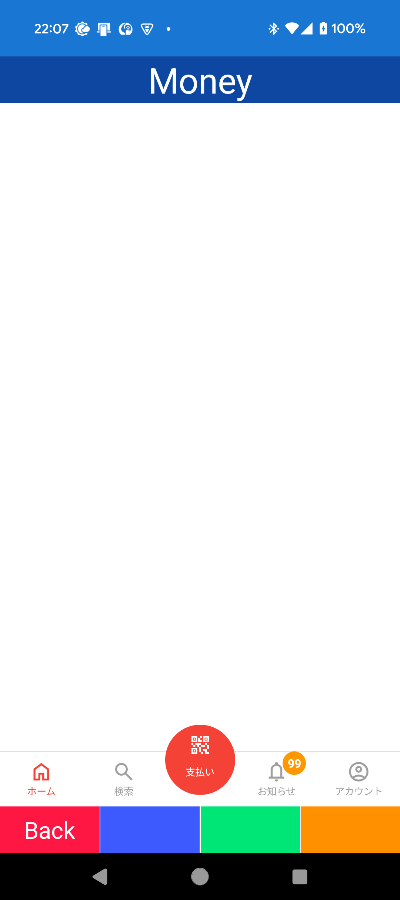
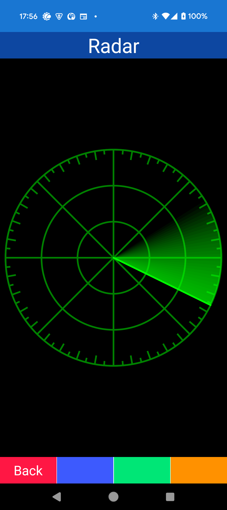
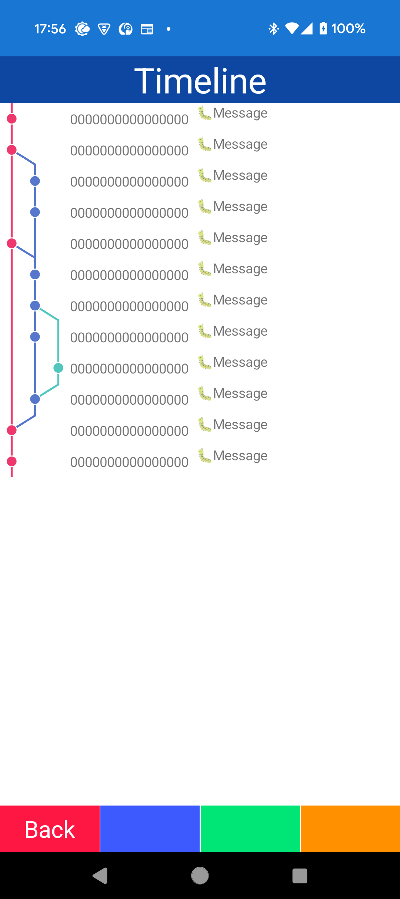
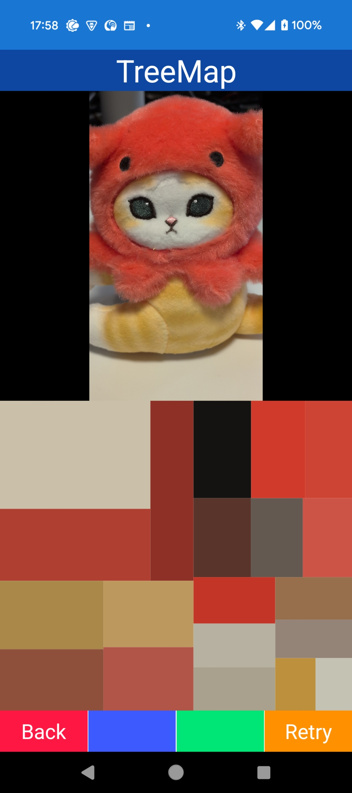

# Template project for MAUI

Template project for MAUI.

- [日本語](README-ja.md)

# Image

## Device

## Sample

## UI

# TODO

## Device

- [ ] **WiFi manager**
- [ ] Biometric

## UI

- [ ] **Gauge**
- [ ] Chart
- [ ] Calendar

## Other

- [ ] **Cognitive service**
- [ ] **Map2**
- [ ] **HybridWebView**
- [ ] Chat
- [ ] Push -> Hybrid?
- [ ] Local notification -> Hybrid?

## Ex

- [ ] **.NET 10/XAML**

# Implement

- Basic
  - Typography/Style/Font
  - Converter/Behavior
  - Dialog
  - Validation
  - Grahics
- Navigation
  - Basic/Stack/Wizard
- Device
  - Device status
  - Sensor/Location
  - QR Scan(Android AI)/Display
  - Camera/OCR(Android AI)
  - BLE/Bluetooth Serial
  - NFC
  - Audio
  - Screen/Vibrate/Feed/LED/Sppek/Recognize
- Data
  - SQLite
- Network
  - Web API
- Sample
  - Object detection(Local)
  - Markdown
- UI
  - Dock
  - Timeline/TreeMap
