# Template project for MAUI

Template project for MAUI.

# Image

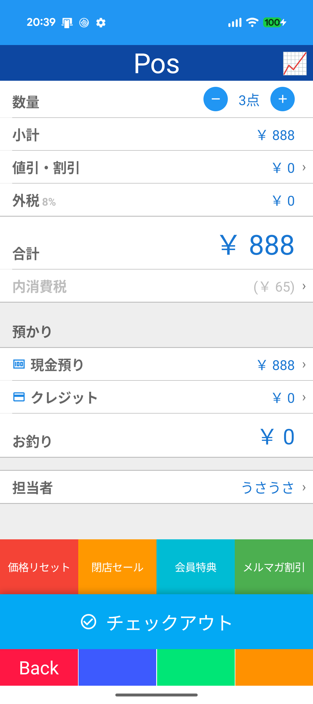
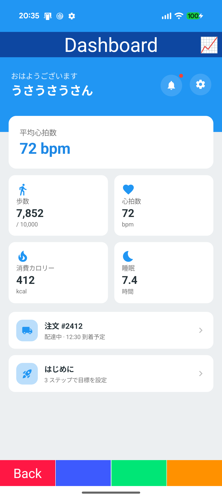

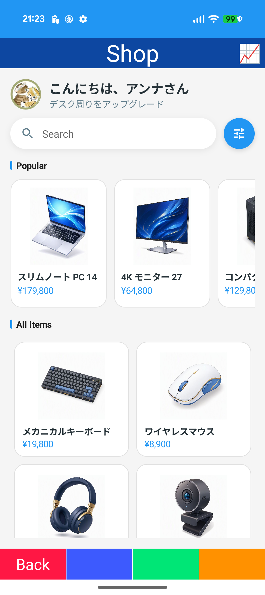

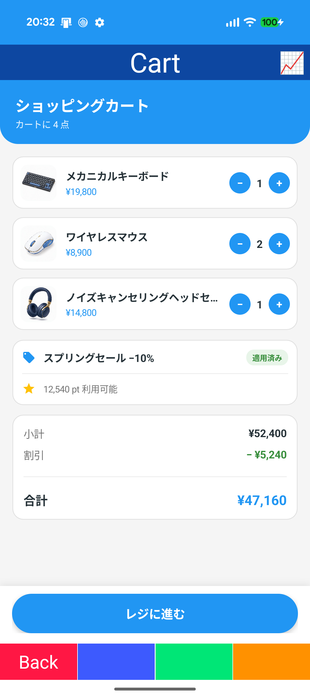

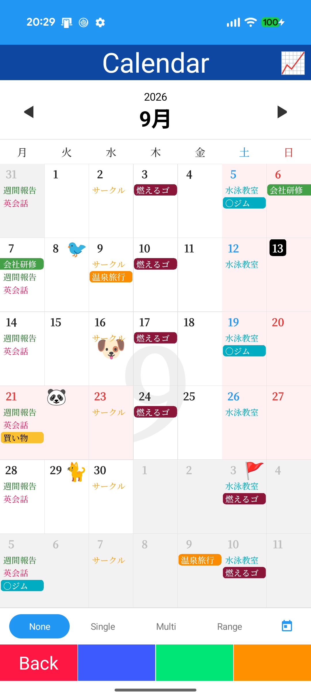

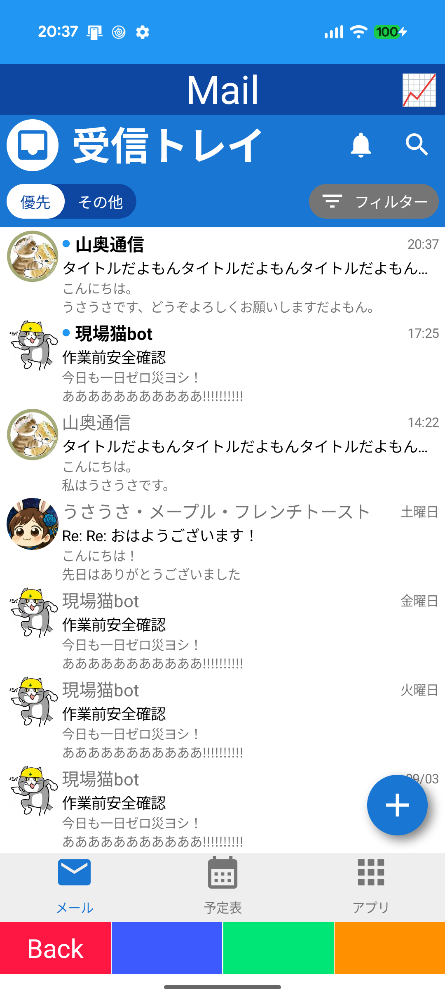
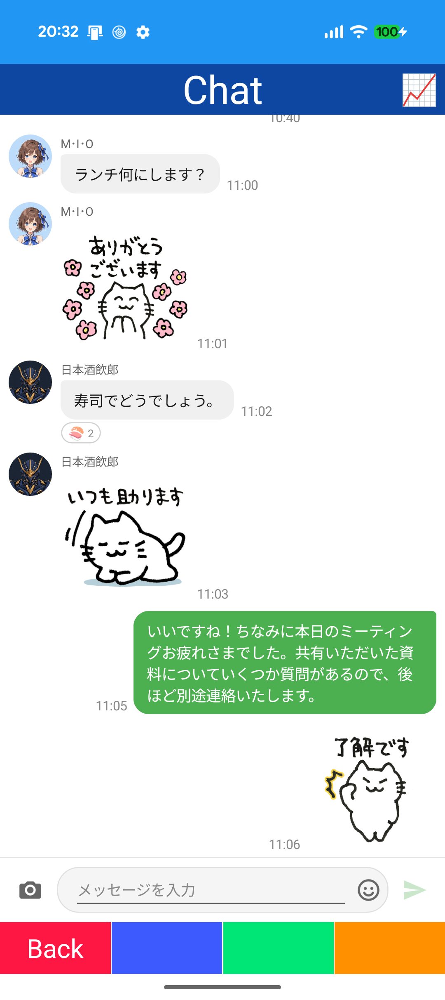

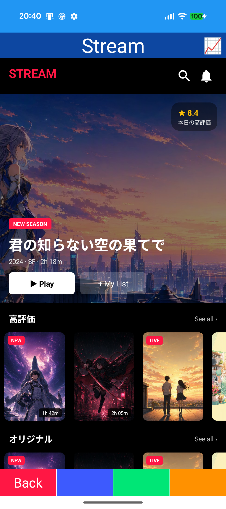

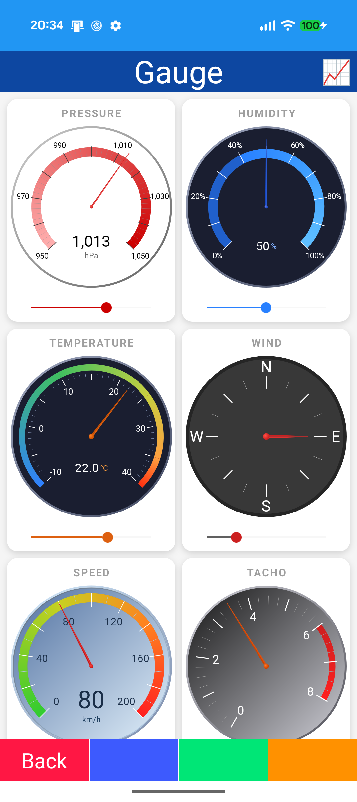

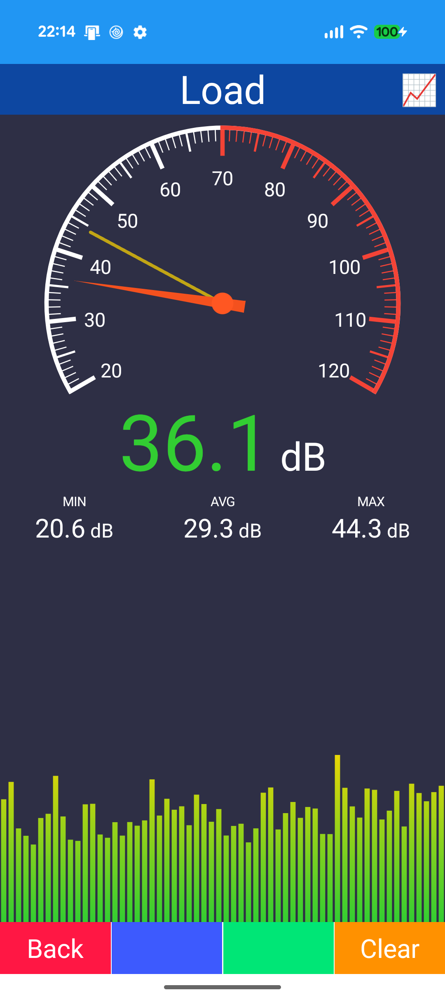

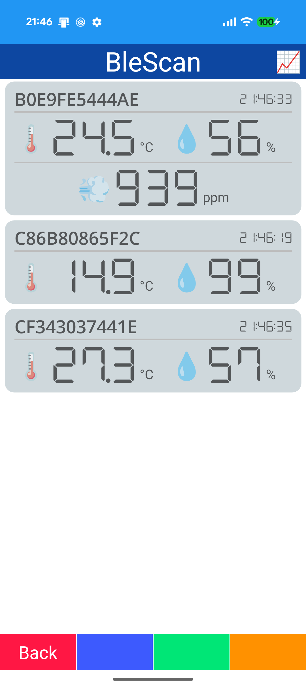
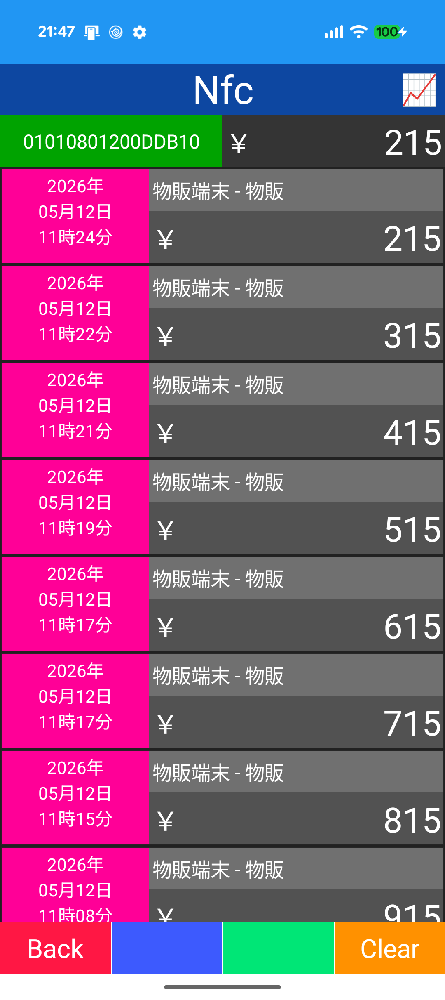

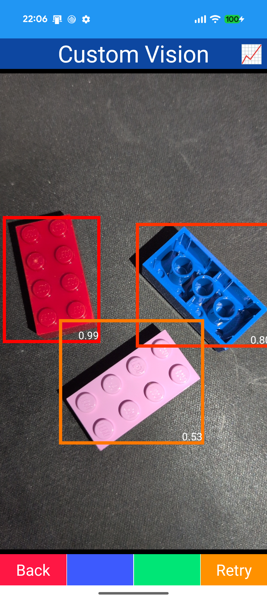

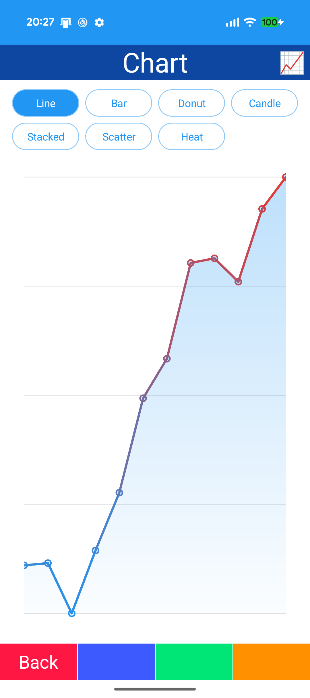

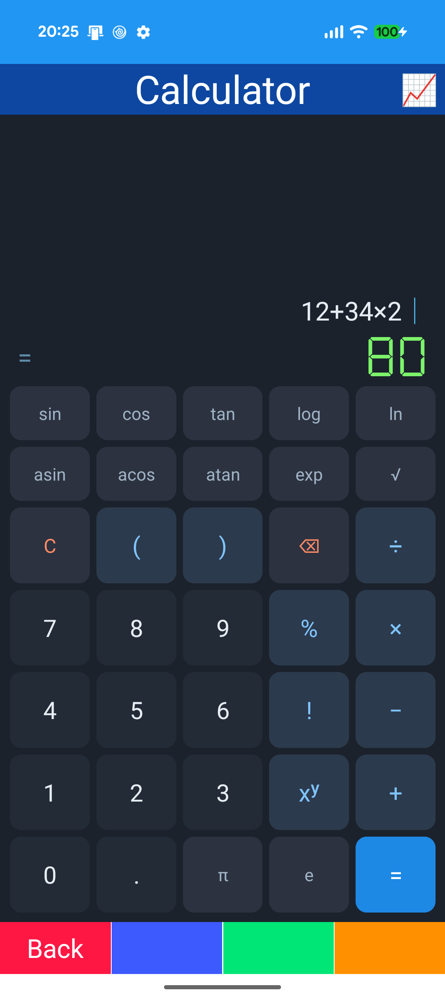

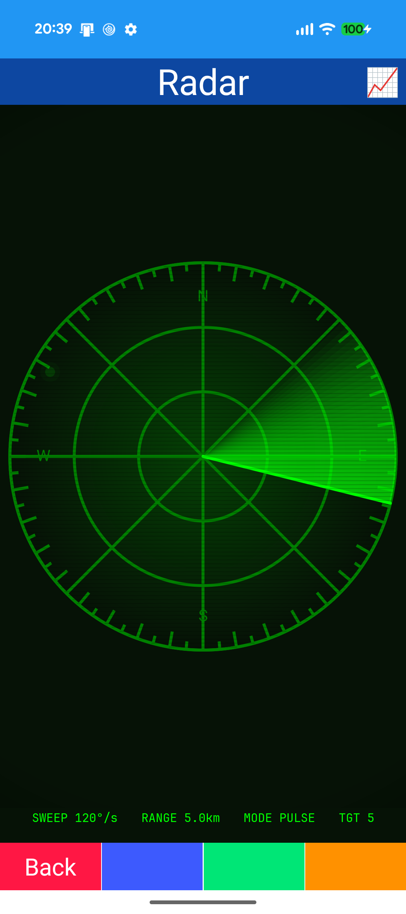

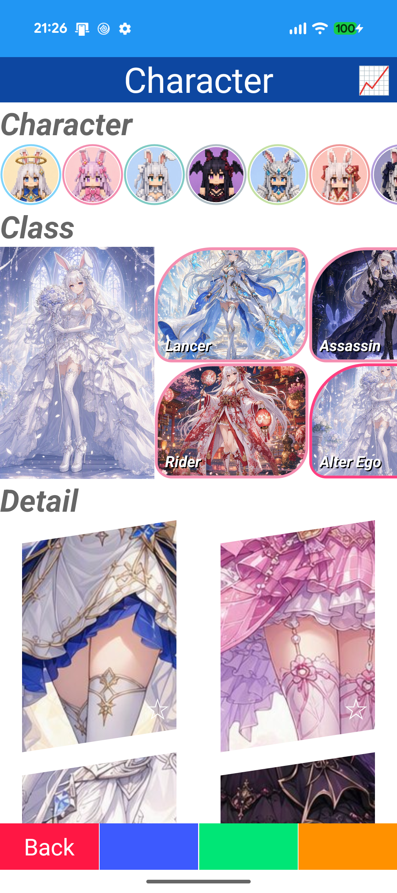
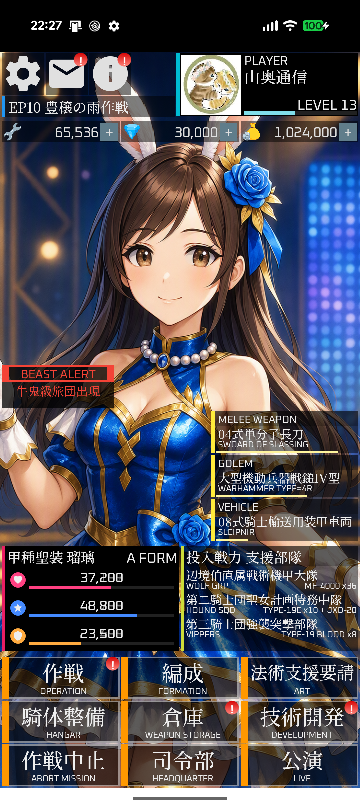

# TODO

| Category | Feature |
| --- | --- |
| Device | **WiFi manager** / Biometric |
| View | Grid control(Table) |
| UI | **Bottom sheet** |
| Other | **Cognitive service** / **Chat AI** / Push -> Hybrid? / Local notification -> Hybrid? |

# Implement

| Category | Feature |
| --- | --- |
| Basic | Typography / Style / Font / Converter / Behavior / Dialog / Validation / Localization / Setting |
| Navigation | Basic / Stack / Wizard / Shared / Initialize / Cancel / Dialog |
| Device | Info / Status / Sensor / Location / QR Scan(Android AI) / QR Display / Camera / OCR(Android AI) / BLE / Bluetooth Serial / NFC / Audio / Activity / Communication / Screen / Vibrate / Feed / LED / Speak / Recognize |
| Data | SQLite |
| Network | Web API / Realtime(SignalR) / SCP |
| View | Collection / Layout / Carousel / Refresh / Border / Shadow / Animation / Easing / Lottie / SVG / Graphics / Drawing / DragDrop / Effect / State / Toolkit / Custom |
| Sample | Web view / HybridWebView / Map / Map2 / Chart / SfChart / Media play / Markdown / PDF reader / Object detection(Local) / Chat / Crop |
| App | Calculator / Sudoku |
| UI 1 | Profile / Login / Money / Super / POS / Shop / Item / Cart / Schedule / Calendar / Timeline / Mail / Chat / Kit(Dashboard, Notification, Setting, Onboarding, Tracking) / Graph / Graph2 / TreeMap |
| UI 2 | Stream / Dock / Load / Gauge / Meter / Mixer / Monster / Wheel / Character / Social / Radar / Flight / Tactical / Telemetry / Energy |
