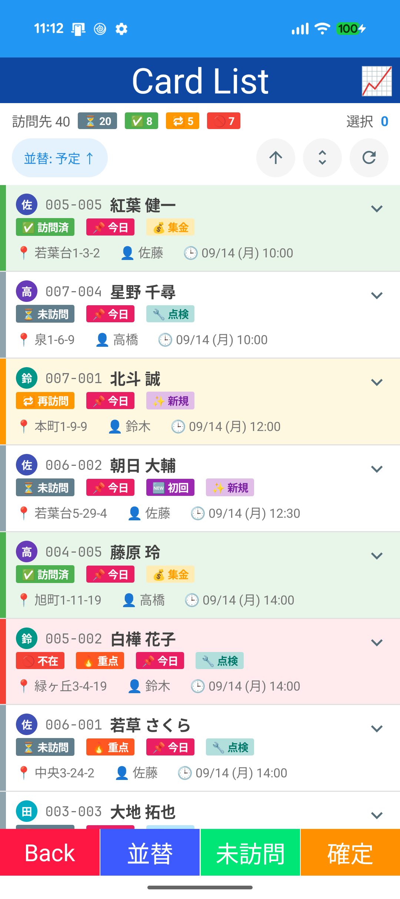
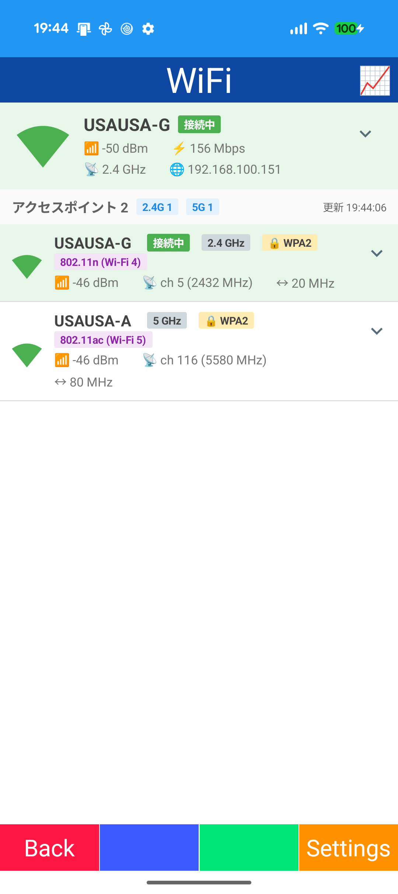

# Template project for MAUI

Template project for MAUI.

# Image

# Implement

| Category | Feature |
| --- | --- |
| Basic | Typography / Style / Font / Converter / Behavior / Dialog / Validation / Localization / Setting |
| Navigation | Basic / Stack / Wizard / Shared / Initialize / Cancel / Dialog |
| Device | Info / Status / Sensor / Location / QR Scan(Android AI) / QR Display / Camera / OCR(Android AI) / WiFi / BLE / Bluetooth Serial / NFC / Audio / Activity / Communication / Screen / Vibrate / Feed / LED / Speak / Recognize / Local notification |
| Data | SQLite |
| Network | Web API(Data CRUD / JWT Authentication) / Storage / Realtime(SignalR) / gRPC(Chat) / SFTP / Telemetry(OpenTelemetry) |
| View | Layout / Border / Shadow / Animation / Easing / Lottie / SVG / Graphics / Drawing / DragDrop / Effect / State |
| Control | Collection / Carousel / Refresh / Toolkit / Custom / Chart / SfChart / Bottom sheet(SfBottomSheet, custom) / Drawer(SfNavigationDrawer, custom) |
| Sample | Web view / HybridWebView / Map / Map2 / Media play / Markdown / PDF reader / Object detection(Local) / Object, Tag, People, OCR(Azure AI Vision) / Chat(Ollama) / Crop |
| App | Calculator / Sudoku |
| UI | Profile / Login / Money / Super / POS / Shop / Item / Cart / Grid(ClamGrid) / Visit / Calendar(ClamCalendar) / Schedule / Mail / Chat / Timeline / Kit(Dashboard, Notification, Setting, Onboarding, Tracking) / Graph / Graph2 / TreeMap / Stream / Dock / Load / Gauge / Meter / Mixer / Monster / Wheel / Character / Social / Radar / Flight / Tactical / Telemetry / Energy |

# TODO

| Category | Feature |
| --- | --- |
| Diagnostics | OpenTelemetry(crash report / telemetry) |
| Device | Background task(WorkManager) |
| Network | Offline sync |
| Device | Push(FCM) |
| Device | Biometric |
| UI | Remaining visual attributes to styles |
| Decision | Pending decisions (guard for unconfigured endpoints / CoreCLR runtime) |

## Pending

| Item | Waiting for |
| --- | --- |
| Global xmlns (`http://schemas.microsoft.com/dotnet/maui/global`) for XAML | ReSharper support (build passes, inspectcode cannot resolve) |
| CoreCLR runtime (`UseMonoRuntime=false`) | .NET 11 (Shiny `[Export]` startup crash: dotnet/android#10996) |

# My Libraries

| Library | Description |
| --- | --- |
| [Usa.Smart.Mvvm](https://github.com/usausa/Smart-Net-Mvvm) | MVVM |
| [Usa.Smart.Reactive](https://github.com/usausa/Smart-Net-Reactive) | Reactive Extensions helpers |
| [Usa.Smart.Results](https://github.com/usausa/Smart-Net-Results) | Result pattern |
| [Usa.Smart.Navigation](https://github.com/usausa/Smart-Net-Navigation) | Navigation |
| [Usa.Smart.Maui](https://github.com/usausa/Smart-Net-Maui) | MAUI MVVM helpers |
| [Usa.Smart.Data.Accessor](https://github.com/usausa/Smart-Net-Data-Accessor) | Source generator based data accessor |
| [Usa.Smart.Mapper](https://github.com/usausa/Smart-Net-Mapper) | Object mapper |
| [Components.Maui](https://github.com/usausa/MauiComponents) | MAUI components(dialog, popup, screen, etc.) |
| [Rester](https://github.com/usausa/Rester) | HttpClient extensions |
| [ClamGrid](https://github.com/usausa/clam-grid) | SkiaSharp grid view |
| [ClamCalendar](https://github.com/usausa/clam-calendar) | SkiaSharp calendar view |
| [Mofucat.ReactiveHub](https://github.com/usausa/mofucat-reactive-hub) | Reactive SignalR hub connection |
| [BunnyTail.DependencyInjection](https://github.com/usausa/bunnytail-dependency-injection) | Source generator based DI |
| [BunnyTail.EmbeddedBuildProperty](https://github.com/usausa/bunnytail-embedded-build-property) | Embedded build property generator |
| [BunnyTail.MemberAccessor](https://github.com/usausa/bunnytail-member-accessor) | Member accessor generator |
| [BunnyTail.XamlProperty.Maui](https://github.com/usausa/bunnytail-xaml-property) | BindableProperty generator |
