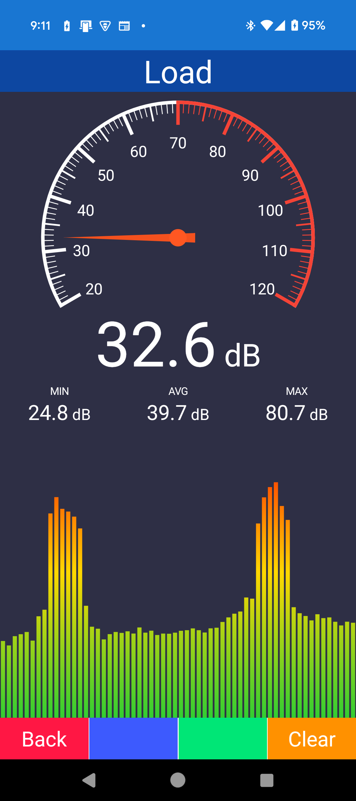

# Template project for MAUI

Template project for MAUI.

- [日本語](README-ja.md)

# TODO

## Cleanup

- [ ] Style sheat
- [ ] Behavior samples
- [ ] Converter samples

## Device

- [ ] **Bluetooth client**
- [ ] **WiFi manager**
- [ ] Biometric

## UI

- [ ] **Gauge**
- [ ] Chart
- [ ] Calendar

## Other

- [ ] **Cognitive service**
- [ ] Chat
- [ ] HybridWebView/Blazor
- [ ] Push

## Ex

- [ ] **.NET 10/XAML**

# Image

## Device

## Sample

## UI

